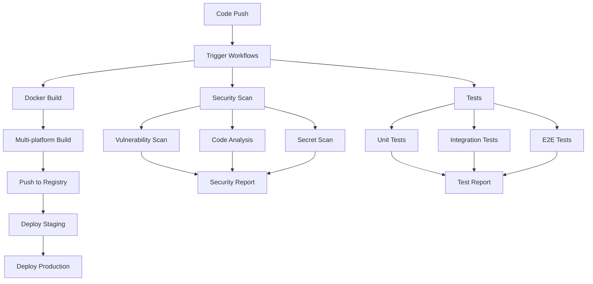

# 🚀 CI/CD Pipeline для WB Slots

Полная система непрерывной интеграции и развертывания для автоматической сборки, тестирования и публикации Docker образов.

## 📋 Обзор

Эта система CI/CD обеспечивает:
- ✅ **Автоматическую сборку** Docker образов
- ✅ **Многоэтапное тестирование** (unit, integration, e2e)
- ✅ **Сканирование безопасности** (vulnerabilities, secrets, licenses)
- ✅ **Публикацию в реестры** (GitHub Container Registry, Docker Hub)
- ✅ **Автоматическое создание релизов**
- ✅ **Обновление зависимостей**
- ✅ **Документацию**

## 🏗️ Архитектура Pipeline



## 📁 Структура файлов

```
.github/
├── workflows/
│   ├── docker-build.yml          # Основная сборка
│   ├── docker-multi-stage.yml    # Многоэтапная сборка
│   ├── docker-hub.yml            # Docker Hub публикация
│   ├── security-scan.yml         # Сканирование безопасности
│   ├── release.yml               # Создание релизов
│   ├── docs.yml                  # Документация
│   └── version-bump.yml          # Обновление версий
├── dependabot.yml                # Автообновления
└── codeql.yml                    # Анализ кода
```

## 🔄 Workflows

### 1. **docker-build.yml** - Основная сборка
**Назначение:** Сборка и публикация Docker образов

**Триггеры:**
- Push в `main` или `develop`
- Push тегов `v*`
- Pull requests в `main`

**Этапы:**
1. **Checkout** - получение кода
2. **Setup Docker Buildx** - настройка сборки
3. **Login to Registry** - аутентификация
4. **Extract Metadata** - извлечение метаданных
5. **Build and Push** - сборка и публикация
6. **Test** - запуск тестов
7. **Security Scan** - сканирование безопасности
8. **Deploy** - развертывание

### 2. **docker-multi-stage.yml** - Многоэтапная сборка
**Назначение:** Сборка разных типов образов

**Типы образов:**
- **Development** (`builder` target)
- **Production** (`runner` target)
- **Test** (`builder` target)

**Особенности:**
- Условная сборка по типу
- Кэширование для ускорения
- Многоэтапное тестирование

### 3. **docker-hub.yml** - Docker Hub
**Назначение:** Публикация в Docker Hub

**Функции:**
- Публикация в Docker Hub
- Обновление описания образа
- Уведомления о статусе

### 4. **security-scan.yml** - Безопасность
**Назначение:** Комплексное сканирование безопасности

**Сканеры:**
- **Trivy** - уязвимости в образах
- **npm audit** - уязвимости в зависимостях
- **Snyk** - дополнительные проверки
- **CodeQL** - анализ кода
- **Hadolint** - проверка Dockerfile
- **TruffleHog** - поиск секретов
- **License Checker** - проверка лицензий

### 5. **release.yml** - Релизы
**Назначение:** Автоматическое создание релизов

**Функции:**
- Создание GitHub Release
- Генерация changelog
- Сборка всех образов
- Загрузка образов как assets

### 6. **docs.yml** - Документация
**Назначение:** Автоматическое обновление документации

**Функции:**
- Сборка документации
- Публикация на GitHub Pages
- Обновление индекса

### 7. **version-bump.yml** - Версии
**Назначение:** Автоматическое обновление версий

**Типы обновлений:**
- **patch** - исправления
- **minor** - новые функции
- **major** - breaking changes
- **prerelease** - альфа/бета/rc

## 🚀 Быстрый старт

### 1. Настройка репозитория

```bash
# Клонирование
git clone https://github.com/your-username/wb-slots.git
cd wb-slots

# Создание веток
git checkout -b develop
git push -u origin develop
```

### 2. Настройка секретов

В `Settings` → `Secrets and variables` → `Actions`:

#### Обязательные:
- `GITHUB_TOKEN` - автоматически

#### Опциональные:
- `DOCKERHUB_USERNAME` - Docker Hub
- `DOCKERHUB_TOKEN` - Docker Hub
- `SNYK_TOKEN` - Snyk
- `SLACK_WEBHOOK` - Slack уведомления

### 3. Запуск сборки

#### Автоматический:
```bash
# Push в main
git push origin main

# Создание релиза
git tag v1.0.0
git push origin v1.0.0

# Pull Request
git checkout -b feature/new-feature
git push origin feature/new-feature
```

#### Ручной:
1. `Actions` → выберите workflow
2. `Run workflow`
3. Выберите параметры

## 📊 Мониторинг

### Дашборды
- **Actions** - статус сборок
- **Security** - результаты сканирования
- **Packages** - опубликованные образы
- **Releases** - созданные релизы
- **Pages** - документация

### Уведомления
- Email о статусе сборки
- Slack уведомления
- GitHub notifications

## 🐳 Docker образы

### Реестры
- **GitHub Container Registry**: `ghcr.io/your-username/wb-slots`
- **Docker Hub**: `your-username/wb-slots`

### Теги
- `latest` - последняя версия main
- `v1.0.0` - конкретная версия
- `dev` - development версия
- `test` - test версия

### Использование
```bash
# Production
docker pull ghcr.io/your-username/wb-slots:latest
docker run -d --name wb-slots-app -p 3000:3000 ghcr.io/your-username/wb-slots:latest

# Development
docker pull ghcr.io/your-username/wb-slots-dev:latest
docker run -d --name wb-slots-dev -p 3000:3000 ghcr.io/your-username/wb-slots-dev:latest
```

## 🔧 Настройка

### Изменение триггеров
```yaml
on:
  push:
    branches: [ main, develop ]  # Изменить ветки
    tags: [ 'v*' ]               # Изменить теги
  schedule:
    - cron: '0 2 * * 1'          # Изменить расписание
```

### Добавление тестов
```yaml
- name: Run custom tests
  run: |
    docker run --rm wb-slots-app:test npm run test:custom
```

### Изменение платформ
```yaml
platforms: linux/amd64,linux/arm64,linux/arm/v7
```

### Настройка уведомлений
```yaml
- name: Notify Slack
  uses: 8398a7/action-slack@v3
  with:
    status: ${{ job.status }}
    webhook_url: ${{ secrets.SLACK_WEBHOOK }}
```

## 🆘 Troubleshooting

### Частые проблемы

#### 1. Сборка не запускается
- Проверьте синтаксис YAML
- Убедитесь в правильности триггеров
- Проверьте права доступа

#### 2. Ошибки сборки Docker
- Проверьте Dockerfile
- Убедитесь в правильности контекста
- Проверьте доступность базовых образов

#### 3. Проблемы с публикацией
- Проверьте токены аутентификации
- Убедитесь в правах доступа к реестру
- Проверьте лимиты GitHub Packages

#### 4. Тесты падают
- Проверьте зависимости
- Убедитесь в правильности тестовых файлов
- Проверьте переменные окружения

### Логи и отладка
```bash
# Просмотр логов
# GitHub Actions → выберите workflow → выберите job → выберите step

# Локальная отладка
docker build -t wb-slots-app:debug .
docker run --rm wb-slots-app:debug npm test
```

## 📚 Полезные ссылки

- [GitHub Actions](https://docs.github.com/en/actions)
- [Docker Buildx](https://docs.docker.com/buildx/)
- [GitHub Container Registry](https://docs.github.com/en/packages/working-with-a-github-packages-registry/working-with-the-container-registry)
- [Trivy Security Scanner](https://aquasecurity.github.io/trivy/)
- [CodeQL](https://codeql.github.com/)
- [Dependabot](https://docs.github.com/en/code-security/dependabot)

## 🎯 Готово!

Теперь у вас есть полная система CI/CD для автоматической сборки и развертывания! 🚀

### Основные команды:
- **Просмотр статуса**: GitHub Actions
- **Ручной запуск**: Actions → Run workflow
- **Создание релиза**: `git tag v1.0.0 && git push origin v1.0.0`
- **Обновление версии**: Actions → Version Bump → Run workflow
