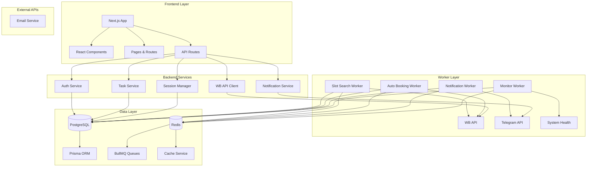
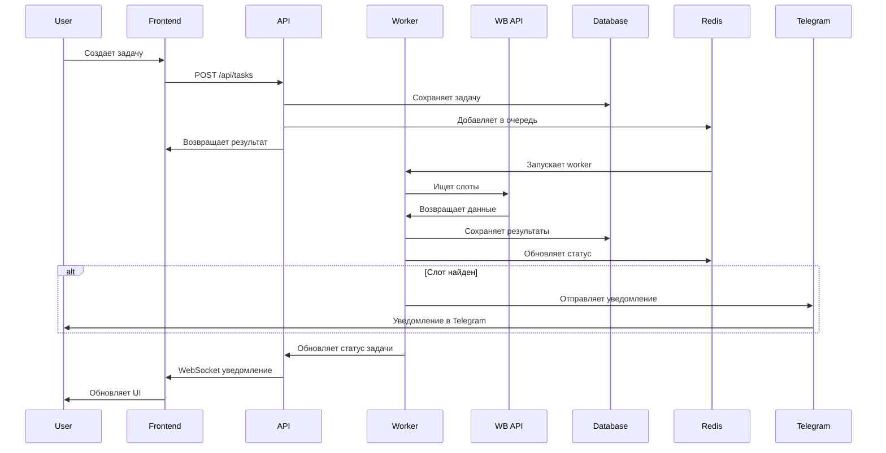
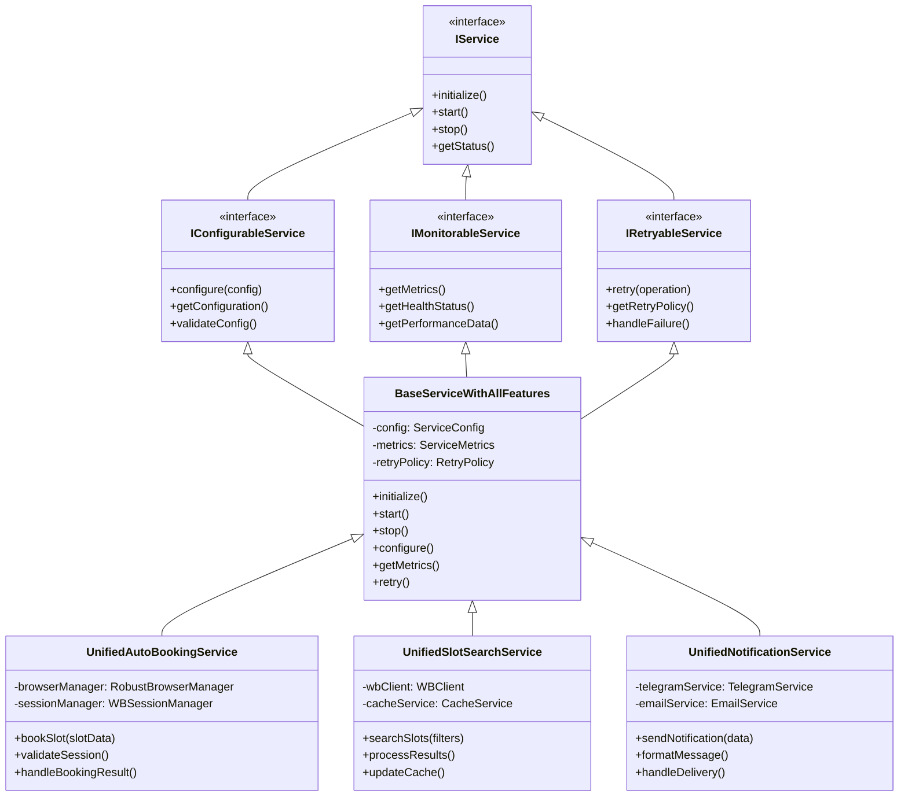
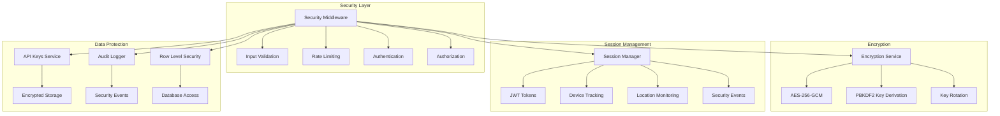
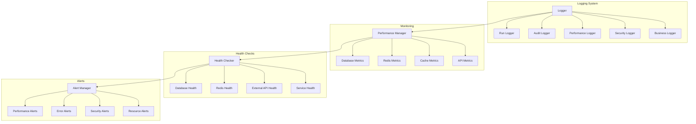
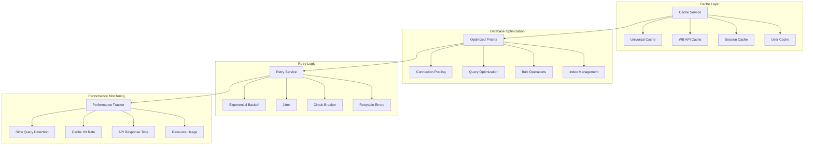
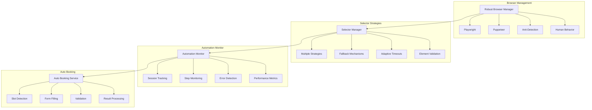
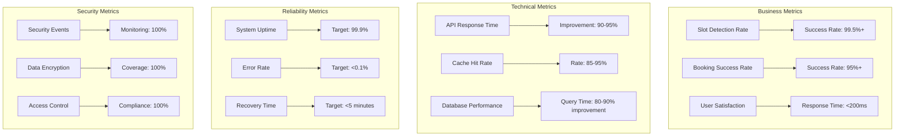
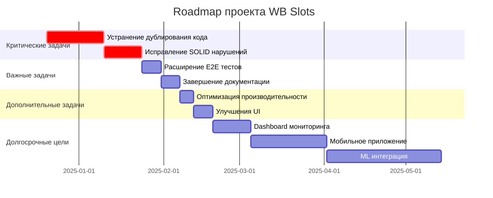

# 🏗️ Диаграммы архитектуры проекта WB Slots

## 📊 Общая архитектура системы

## 🔄 Поток данных и взаимодействие сервисов

## 🏛️ Унифицированная архитектура сервисов

## 🔒 Система безопасности

## 📊 Система мониторинга и логирования

## 🚀 Производительность и кэширование

## 🤖 Браузерная автоматизация

## 📈 Метрики и KPI

## 🗺️ Roadmap и приоритеты

