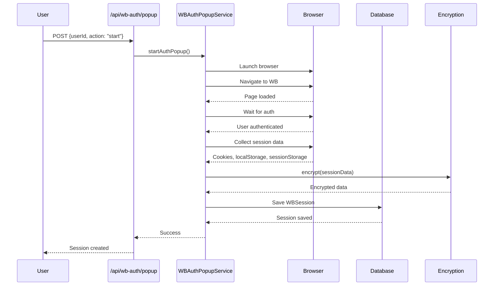
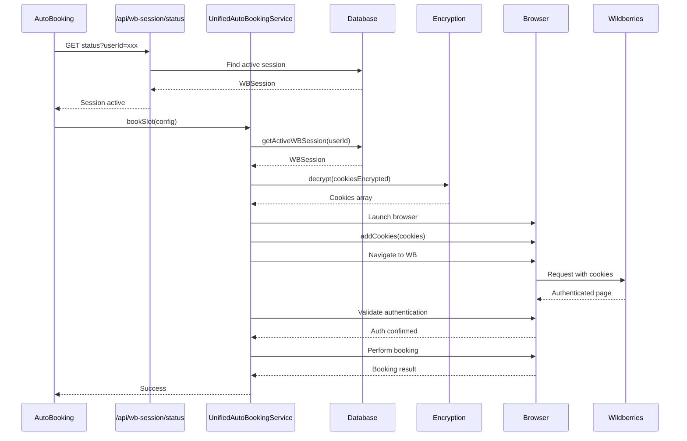
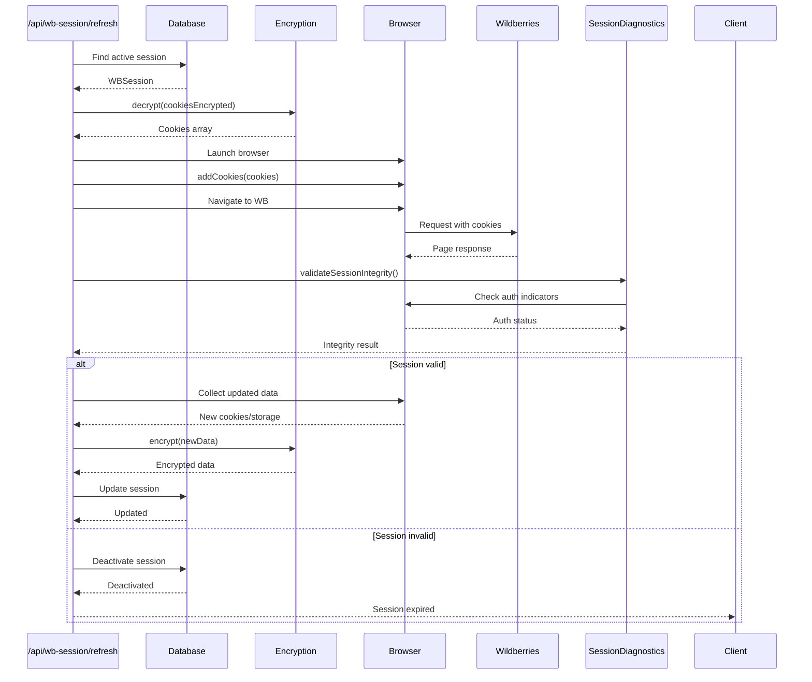

# 🏗️ Архитектура системы сессий WB для авто бронирования

## 📋 Обзор системы

Система управления сессиями WB состоит из нескольких взаимосвязанных компонентов, обеспечивающих надежное сохранение, восстановление и валидацию пользовательских сессий для авто бронирования.

## 🔄 Основной поток работы

### 1. **Создание сессии (Авторизация)**
```
Пользователь → WB Auth Popup → Сохранение сессии → База данных
```

### 2. **Использование сессии (Авто бронирование)**
```
Авто бронирование → Получение сессии → Восстановление cookies → Валидация → Выполнение
```

### 3. **Обновление сессии (Refresh)**
```
Проверка сессии → Восстановление → Валидация → Обновление данных → Сохранение
```

## 🏛️ Архитектурные компоненты

### **1. API Endpoints (Слой представления)**

#### **`/api/wb-auth/popup`** - Создание сессии
```typescript
POST /api/wb-auth/popup
{
  "userId": "user-id",
  "action": "start" | "check" | "close"
}
```

**Функции:**
- Запуск браузера для авторизации
- Отслеживание процесса авторизации
- Сохранение сессии после успешной авторизации

#### **`/api/wb-session/refresh`** - Обновление сессии
```typescript
POST /api/wb-session/refresh
{
  "userId": "user-id"
}
```

**Функции:**
- Восстановление cookies из БД
- Валидация сессии в браузере
- Обновление данных сессии
- Деактивация недействительных сессий

#### **`/api/wb-session/status`** - Проверка статуса
```typescript
GET /api/wb-session/status?userId=user-id
```

**Функции:**
- Проверка активности сессии
- Валидация срока действия
- Возврат статуса для UI

#### **`/api/wb-session/force-create`** - Принудительное создание
```typescript
POST /api/wb-session/force-create
{
  "userId": "user-id",
  "phoneNumber": "+7XXXXXXXXXX",
  "smsCode": "123456"
}
```

**Функции:**
- Создание новой сессии через телефон
- Обработка SMS кода
- Сохранение валидной сессии

#### **`/api/wb-session/cleanup`** - Очистка сессий
```typescript
POST /api/wb-session/cleanup
{
  "userId": "user-id",
  "action": "deactivate-invalid" | "deactivate-all" | "validate-and-cleanup"
}
```

**Функции:**
- Деактивация недействительных сессий
- Валидация через браузер
- Очистка устаревших данных

### **2. Сервисы (Бизнес-логика)**

#### **`WBAuthPopupService`** - Управление авторизацией
```typescript
class WBAuthPopupService {
  async startAuthPopup(config: WBAuthPopupConfig): Promise<void>
  async checkAuthStatus(): Promise<WBAuthStatus>
  async closeAuthPopup(): Promise<void>
  async saveSessionData(): Promise<void>
}
```

**Ответственности:**
- Запуск браузера для авторизации
- Отслеживание процесса авторизации
- Сохранение данных сессии

#### **`UnifiedAutoBookingService`** - Авто бронирование
```typescript
class UnifiedAutoBookingService {
  async bookSlot(config: AutoBookingConfig): Promise<BookingResult>
  private async _validateSession(page: Page, userId: string): Promise<StepResult>
  private async _performBooking(config: AutoBookingConfig): Promise<BookingResult>
}
```

**Ответственности:**
- Валидация сессии перед бронированием
- Восстановление cookies в браузере
- Выполнение операций бронирования

#### **`SessionDiagnosticsService`** - Диагностика сессий
```typescript
class SessionDiagnosticsService {
  async validateSessionIntegrity(page: Page): Promise<SessionIntegrityResult>
  async checkAuthIndicators(page: Page): Promise<string[]>
  async checkPageErrors(page: Page): Promise<string[]>
  async generateDiagnosticsReport(page: Page): Promise<string>
}
```

**Ответственности:**
- Детальная диагностика состояния сессии
- Проверка целостности данных
- Генерация отчетов о проблемах

### **3. Утилиты (Вспомогательные функции)**

#### **`wb-auth-helpers.ts`** - Валидация авторизации
```typescript
export async function checkWBAuthentication(page: Page): Promise<AuthCheckResult>
export async function waitForWBAuthentication(page: Page, options): Promise<AuthCheckResult>
```

**Функции:**
- Проверка индикаторов авторизации
- Ожидание загрузки WB портала
- Обработка страниц-лоадеров

#### **`session-utils.ts`** - Управление сессиями
```typescript
export async function checkWBSessionStatus(userId: string): Promise<SessionStatusResult>
export async function getActiveWBSession(userId: string): Promise<WBSession | null>
export async function deactivateWBSession(sessionId: string): Promise<void>
export async function updateSessionLastUsed(sessionId: string): Promise<void>
```

**Функции:**
- Получение активных сессий
- Проверка статуса сессий
- Управление жизненным циклом сессий

#### **`session-sync-utils.ts`** - Синхронизация сессий
```typescript
export async function syncUserSessions(userId: string): Promise<SyncResult>
export async function validateAndFixSessions(userId: string): Promise<ValidationResult>
export async function getSessionStats(userId: string): Promise<SessionStats>
```

**Функции:**
- Синхронизация множественных сессий
- Валидация и исправление данных
- Статистика по сессиям

### **4. Модель данных (База данных)**

#### **`WBSession`** - Модель сессии
```typescript
model WBSession {
  id              String   @id @default(cuid())
  sessionId       String   @unique
  userId          String
  cookiesEncrypted String
  localStorageEncrypted String?
  sessionStorageEncrypted String?
  userAgent       String?
  isActive        Boolean  @default(true)
  expiresAt       DateTime?
  createdAt       DateTime @default(now())
  lastUsedAt      DateTime @updatedAt
  updatedAt       DateTime @updatedAt
}
```

**Поля:**
- `sessionId` - Уникальный идентификатор сессии
- `userId` - Связь с пользователем
- `cookiesEncrypted` - Зашифрованные cookies
- `localStorageEncrypted` - Зашифрованные данные localStorage
- `sessionStorageEncrypted` - Зашифрованные данные sessionStorage
- `isActive` - Статус активности
- `expiresAt` - Срок действия

### **5. Шифрование (Безопасность)**

#### **`encryption.ts`** - Шифрование данных
```typescript
export function encrypt(data: string): string
export function decrypt(encryptedData: string): string
```

**Функции:**
- Шифрование чувствительных данных
- Расшифровка для использования
- Использование AES-256-GCM

## 🔄 Детальные потоки данных

### **Поток 1: Создание сессии**



### **Поток 2: Авто бронирование**



### **Поток 3: Обновление сессии**



## 🛡️ Безопасность и надежность

### **Шифрование данных**
- Все чувствительные данные шифруются перед сохранением
- Использование AES-256-GCM с уникальными IV
- Ключи шифрования хранятся в переменных окружения

### **Валидация сессий**
- Множественные проверки авторизации
- Обнаружение страниц-лоадеров
- Проверка целостности данных

### **Обработка ошибок**
- Graceful degradation при проблемах с сессиями
- Детальная диагностика проблем
- Автоматическая деактивация недействительных сессий

### **Мониторинг**
- Логирование всех операций с сессиями
- Метрики производительности
- Алерты при критических ошибках

## 📊 Мониторинг и диагностика

### **Логирование**
```typescript
// Примеры логов
🍪 Restoring 9 cookies
🌐 Navigating to WB main page...
⏳ Waiting for page load and checking authentication...
🔍 Authentication check attempt 1/3
✅ Authentication confirmed, found selectors: ['.user-menu', '.supplies-list']
❌ Session validation failed: User not authenticated
🔒 Session deactivated due to error
```

### **Диагностика**
- Проверка целостности сессий
- Анализ проблем с авторизацией
- Генерация отчетов о состоянии

### **Метрики**
- Время восстановления сессий
- Процент успешных валидаций
- Частота обновлений сессий

## 🚀 Оптимизации

### **Кэширование**
- Кэширование активных сессий в памяти
- Инвалидация при изменениях

### **Параллелизм**
- Асинхронная обработка множественных сессий
- Неблокирующие операции с БД

### **Таймауты**
- Адаптивные таймауты для разных операций
- Retry логика с экспоненциальным backoff

## 🔧 Конфигурация

### **Переменные окружения**
```env
# Шифрование
ENCRYPTION_KEY=your-32-byte-key

# Таймауты
WB_AUTH_TIMEOUT=60000
WB_PAGE_LOAD_TIMEOUT=30000
WB_RETRY_DELAY=5000

# Браузер
BROWSER_HEADLESS=true
BROWSER_ARGS=--no-sandbox,--disable-setuid-sandbox
```

### **Настройки сессий**
```typescript
const SESSION_CONFIG = {
  maxRetries: 3,
  retryDelay: 5000,
  sessionTimeout: 7 * 24 * 60 * 60 * 1000, // 7 дней
  validationTimeout: 30000,
  pageLoadTimeout: 60000
};
```

## 📈 Масштабирование

### **Горизонтальное масштабирование**
- Stateless сервисы
- Внешнее хранение сессий
- Load balancing

### **Вертикальное масштабирование**
- Оптимизация запросов к БД
- Кэширование в памяти
- Асинхронная обработка

## 🔍 Отладка и troubleshooting

### **Частые проблемы**
1. **Сессия не создается** - Проверить авторизацию в браузере
2. **Cookies не восстанавливаются** - Проверить формат данных
3. **Валидация не проходит** - Проверить селекторы WB
4. **Таймауты** - Увеличить время ожидания

### **Инструменты диагностики**
- `/api/wb-session/diagnostics` - Детальная диагностика
- `/api/wb-session/debug` - Отладочная информация
- `cleanup-sessions.js` - Очистка сессий

## 📚 Заключение

Архитектура системы сессий обеспечивает:

✅ **Надежность** - Множественные проверки и валидации  
✅ **Безопасность** - Шифрование всех чувствительных данных  
✅ **Производительность** - Оптимизированные операции и кэширование  
✅ **Масштабируемость** - Stateless дизайн и горизонтальное масштабирование  
✅ **Отладка** - Детальная диагностика и логирование  

Система готова к использованию в продакшене и может обрабатывать высокие нагрузки авто бронирования.
